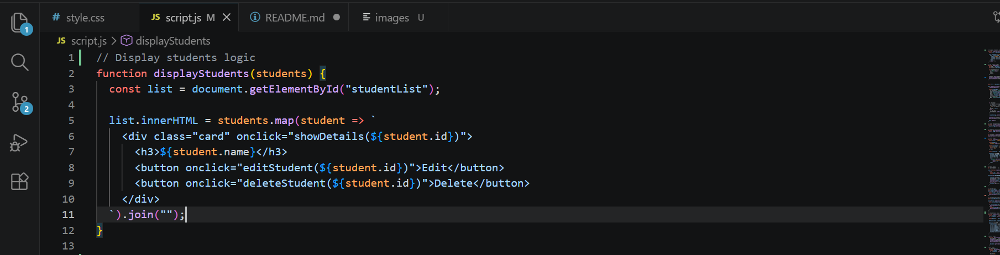

**STUDENT COURSE MANAGEMENT**
A student data management system made by html,css and javascript

#Features
The user could:
-search by name 
-search by course
-add,edit & delete the information
-see the stats representing Number of students in respective course,average of GPA and many more
-can change the mode of representation (Light/Dark) according to convenience

#ES6 concepts
1.Array Function
