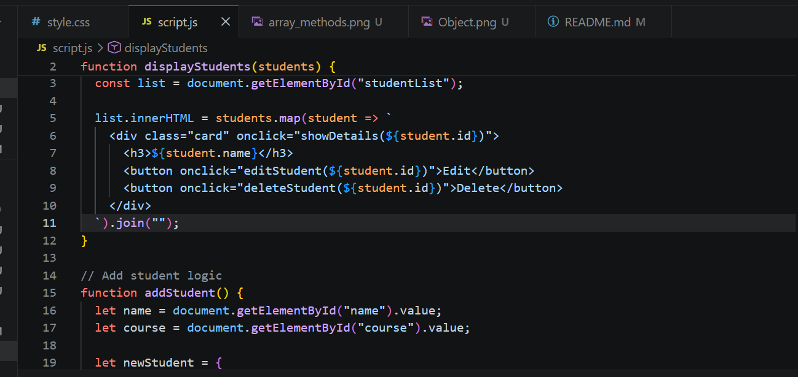
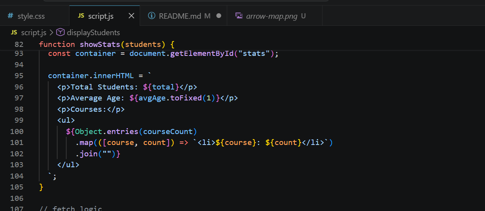
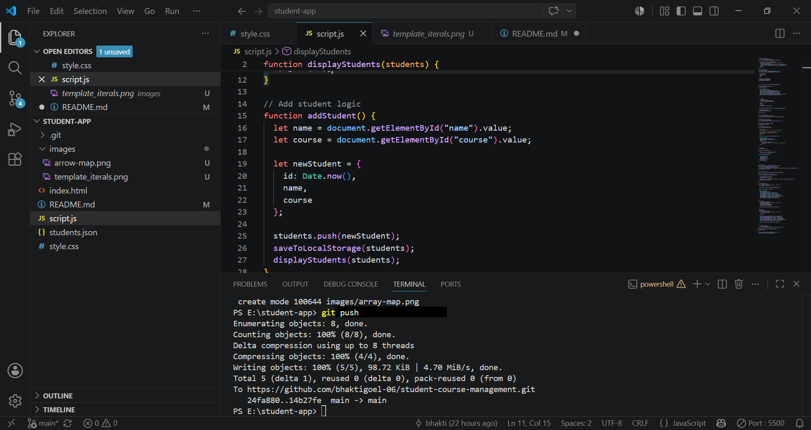
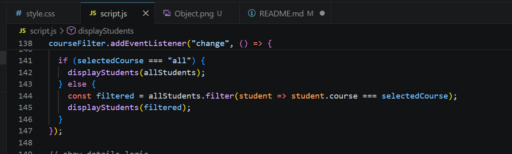
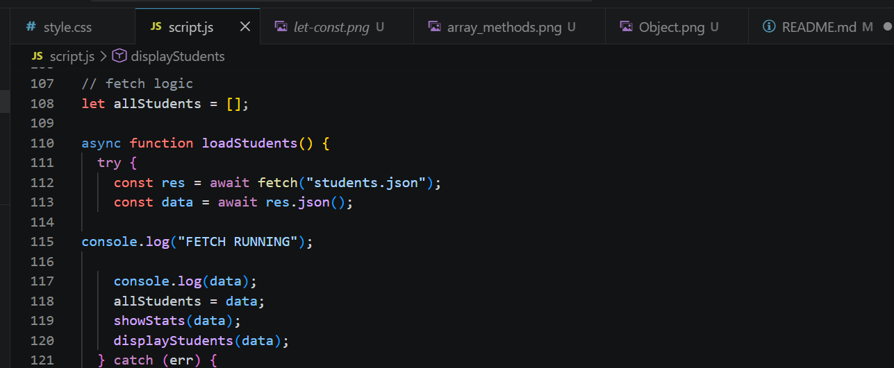

# 🎓 STUDENT COURSE MANAGEMENT

A student data management system made by HTML, CSS and JavaScript

## ⚙️ Setup Instructions

**Step 1:** Clone the repo  

**Step 2:** Click on **Go Live** option in VS Code (bottom right)

## 🚀 Features

The user could:

- Search by name  
- Search by course  
- Add, edit & delete the information  
- See the stats representing number of students in respective course, average of GPA and many more  
- Change the mode of representation (Light/Dark) according to convenience  

## 💡 ES6 Concepts

### 1. Variables  

### 2. Arrow Function (=>)  

### 3. Template Literals ($)  

### 4. Object  

### 5. Array Methods (map, filter, reduce, find)  

### 6. Async & Await  

## ⚡ Challenges Faced

- Facing a lot of issues in modular  
- UI took many modifications  

## 📚 Learnings

- Hands-on GitHub commands  
- JavaScript ES6 concepts  
- How to modify UI (beginner level)  